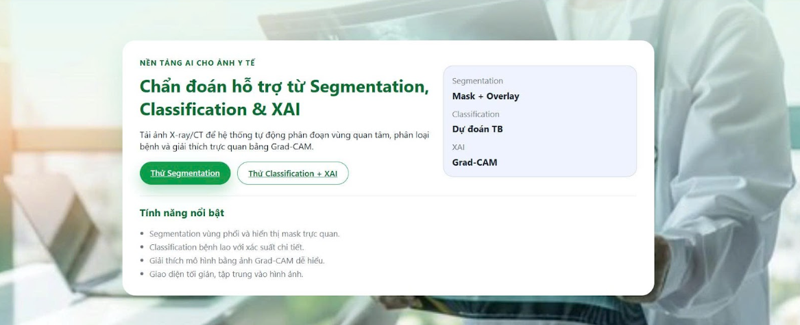
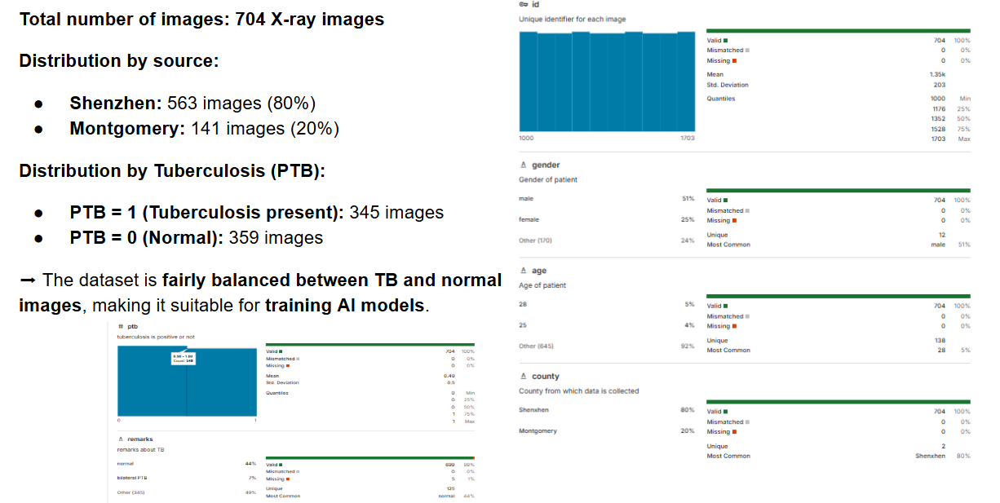
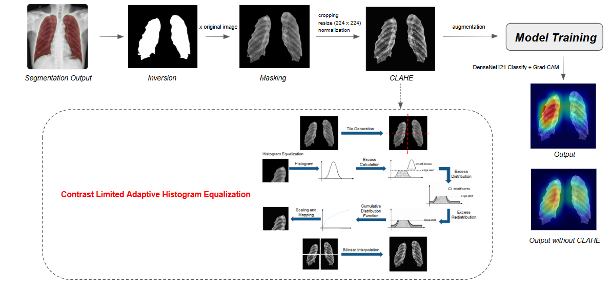
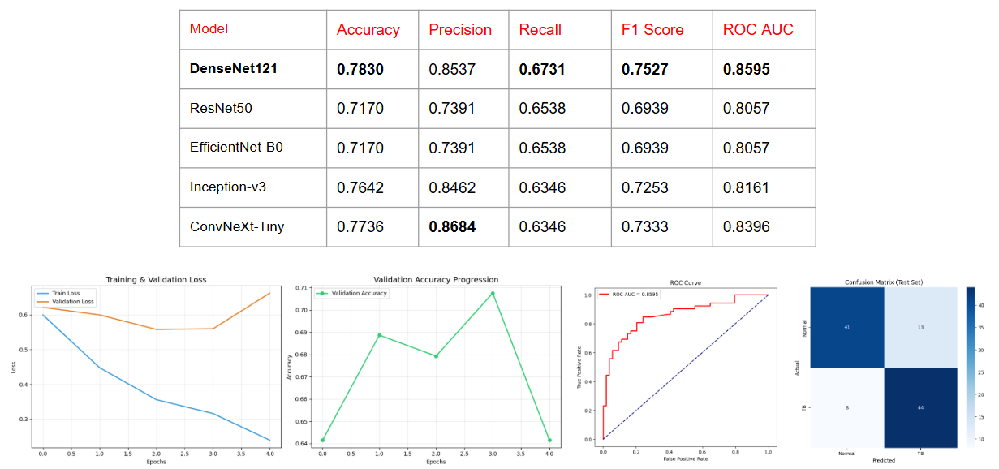
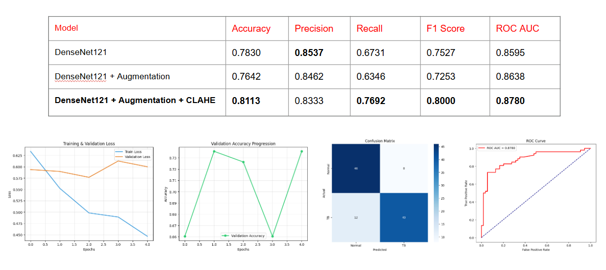
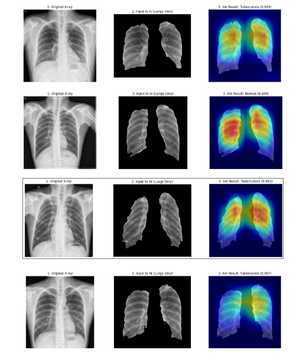

# Segmentation-and-Explainable-Classification-System-for-Tuberculosis-Diagnosis



## Dataset Information: [Chest X-ray Lungs Segmentation Dataset](https://www.kaggle.com/datasets/iamtapendu/chest-x-ray-lungs-segmentation)


## Our Proposed Model


## Experimental Results:



## Example Results:


## Project includes 3 main section:

- **backend_ai**: API AI for segmentation and TB classification.
- **backend_se**: Backend Node.js for authentication and user API.
- **frontend**: Frontend React (Vite).

## System Requirement

- Node.js >= 18
- Python >= 3.9

## Folder Structure

```
imp302m_project/
  backend_ai/
    captioning/
    segmentation/
  backend_se/
  frontend/
```
