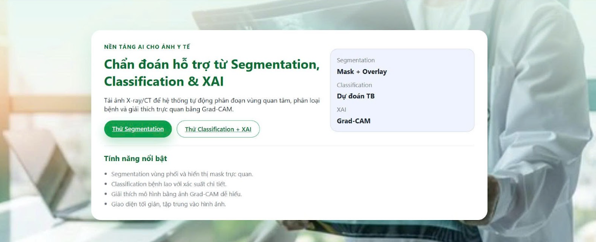
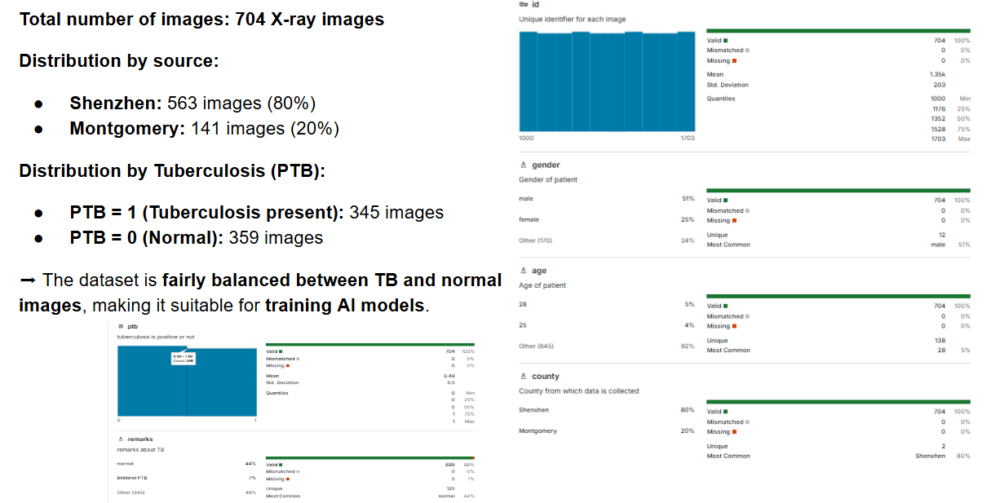
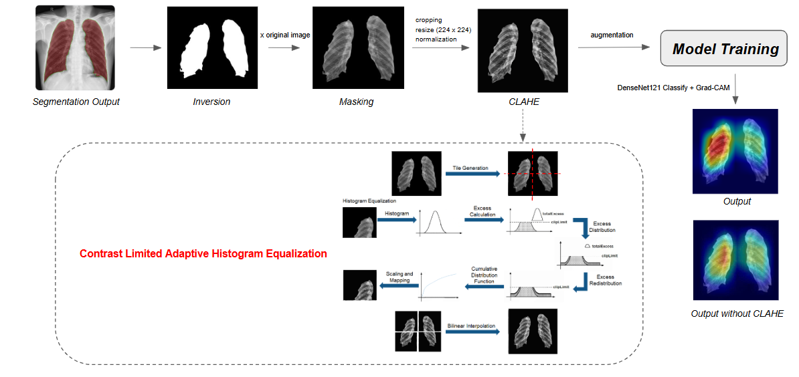
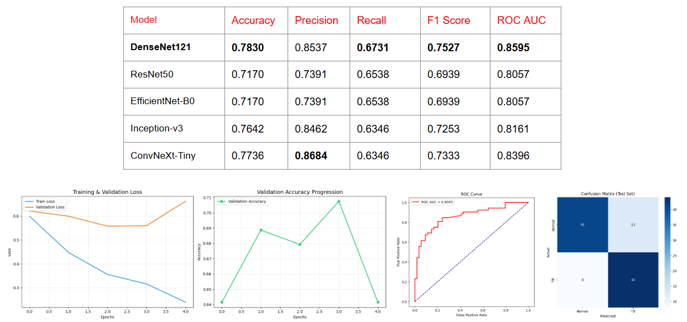
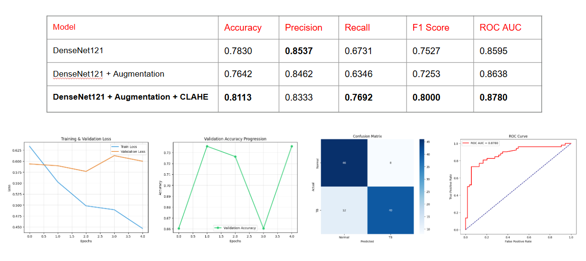
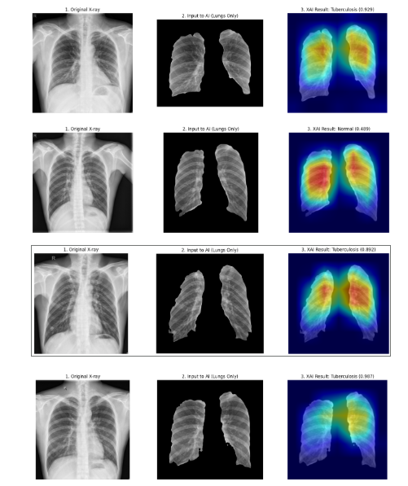

# Segmentation and Explainable Classification System for Tuberculosis Diagnosis



## 📌 Project Overview
This project aims to support accurate and interpretable diagnosis of **Tuberculosis (TB)** from chest X-ray images. It implements a deep learning system that integrates two primary tasks: **Lung Region Segmentation** and **Explainable Disease Classification**.

The core idea is to improve diagnostic reliability by first isolating the lung area and then providing a classification result along with a visual heatmap (Grad-CAM) to explain the model's decision.

---

## Tech Stack

### 💻 Frontend
- **Framework:** React (Vite)
- **Languages:** HTML5, CSS3, JavaScript (ES6+)
- **Routing & State:** React Router, AuthContext, apiClient

### ⚙️ Backend (System Engineering)
- **Runtime:** Node.js
- **Database:** Microsoft SQL Server
- **Security:** JWT (JSON Web Token) for authentication
- **Documentation:** Swagger API
- **Architecture:** Routes → Controllers → Services → Models

### 🧠 Backend (AI Engine)
- **Language:** Python >= 3.9
- **Core Models:** DeepLabV3+ (Segmentation), DenseNet-121 (Classification)
- **Explainability (XAI):** Grad-CAM (Heatmap visualization)
- **Image Processing:** OpenCV, CLAHE (Contrast Limited Adaptive Histogram Equalization)

---

## Dataset Information
The system is trained and validated on the [Chest X-ray Lungs Segmentation Dataset](https://www.kaggle.com/datasets/iamtapendu/chest-x-ray-lungs-segmentation).

- **Total Scale:** 704 chest X-ray images.
- **Sources:** Shenzhen (563 images - 80%) and Montgomery (141 images - 20%).
- **Distribution:** Balanced between TB cases (345 images, PTB=1) and normal cases (359 images, PTB=0).
- **Components:** Original X-rays, Lung Segmentation Masks, and clinical metadata.



---

## Proposed Architecture

### 1. Lung Segmentation Branch
- **Data Split:** 90% Train (633 images), 5% Validation (35 images), 5% Test (36 images).
- **Preprocessing:** Spatial normalization (Resize to 256x256), ImageNet normalization, and Tensor conversion.
- **Architecture:** **DeepLabV3+** utilizing a **ResNet** backbone as the Encoder, combined with **Atrous Spatial Pyramid Pooling (ASPP)**.
- **Performance:** 
    - **Peak mIoU:** 0.950
    - **Pixel Accuracy:** 98.1%

### 2. Explainable Classification Branch
- **Preprocessing Pipeline:** Segmented images undergo Inversion → Masking (cropping to the lung area) → Normalization (224x224) → **CLAHE** → Data Augmentation.
- **Architecture:** **DenseNet-121** (selected for its parameter efficiency and ability to retain unique features in medical imaging).
- **Explainability (XAI):** Integrated **Grad-CAM** algorithm to generate heatmaps, highlighting the specific regions influencing the model's diagnosis.



---

## Experimental Results

The combination of **DenseNet-121 + Augmentation + CLAHE** yielded the highest performance:

| Metric | Result |
| :--- | :--- |
| **Accuracy** | **81.13%** |
| **F1 Score** | **80.00%** |
| **ROC AUC** | **87.80%** |




---

## User Interface & Key Features
The system provides an intuitive web application for medical diagnosis support:
1. **Visual Segmentation:** Real-time lung mask generation and display.
2. **TB Diagnosis:** High-precision classification with detailed probability scores.
3. **Clinical Explanation:** Grad-CAM heatmaps to visualize the "why" behind every diagnosis.



---

## 📂 Folder Structure
```text
imp302m_project/
  backend_ai/          # AI Engine (FastAPI/Flask for Inference)
    captioning/        # XAI and Grad-CAM logic
    segmentation/      # Lung segmentation processing
  backend_se/          # System Backend (Node.js, SQL Server, Auth)
  frontend/            # User Interface (React Vite)
